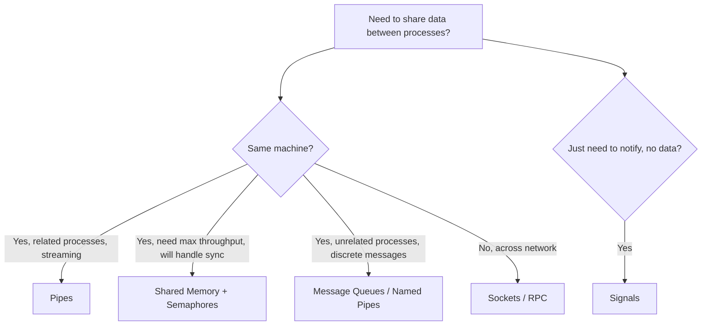

# Interprocess communication (IPC)

Processes are isolated from each other by design (separate virtual address spaces) — that's what makes a crash in one process not take down another. IPC is the set of OS-provided mechanisms that let isolated processes exchange data and synchronize anyway, which matters for anything from a shell pipeline to a distributed system.

## TL;DR
- Processes can't directly touch each other's memory, so the kernel mediates: shared memory, message queues, pipes, semaphores, signals, and sockets are the main mechanisms.
- **Shared memory** is fastest (no copying) but needs explicit synchronization (semaphores) to avoid races.
- **Message passing** (queues) is safer (no shared state) but slower due to copying and kernel routing.
- **Pipes** are the simplest — great for streaming data between related processes (`ls | grep`).
- **Semaphores** provide synchronization/mutual exclusion, not data transfer.
- **Signals** are lightweight asynchronous notifications, not a data channel.
- **Sockets** generalize to both local and networked IPC — the mechanism behind client-server and microservice communication.

## Shared memory

Multiple processes map the same physical memory region into their own virtual address spaces, so writes by one are immediately visible to the other — no copying involved.

**Implementation**: `shmget()` (allocate a shared memory segment), `shmat()` (attach it into your address space), POSIX style.

```c
int shmid = shmget(IPC_KEY, SIZE, IPC_CREAT | 0666);
char *shm = shmat(shmid, NULL, 0);
strcpy(shm, "Hello from Process 1");
// Process 2 reads shm
shmdt(shm); shmctl(shmid, IPC_RMID, NULL);
```

| Pros | Cons |
|---|---|
| Fastest IPC (no copy) | Requires synchronization (e.g., semaphores) to avoid races |
| Bidirectional | Security risks if not isolated properly |

**Advanced**: anonymous shared memory via `mmap()` with `MAP_SHARED` is a common alternative for threads and related processes; huge pages can improve performance for large shared regions by reducing TLB pressure.

## Message passing (queues)

Processes send/receive discrete messages via OS-mediated queues, rather than sharing memory directly. Can be synchronous (blocking) or asynchronous (non-blocking).

- **Types**: Direct (addressed to a specific PID) vs. Indirect (routed via ports/mailboxes, decoupling sender from receiver identity).
- **Primitives**: `send()`/`recv()`, as in models like MPI (Message Passing Interface) used in HPC clusters.

```c
// Sender
msgsnd(msqid, &msgbuf, sizeof(msgbuf.mtext), 0);
// Receiver
msgrcv(msqid, &msgbuf, sizeof(msgbuf.mtext), type, 0);
```

| Pros | Cons |
|---|---|
| No shared state (safer) | Slower due to copying/routing |
| Scalable for distributed systems | Message loss possible if not buffered/acked |

**Advanced**: ZeroMQ or RabbitMQ generalize this pattern into pub-sub messaging for distributed IPC — the same core idea (OS-level message queues) scaled up to a network-level broker.

## Pipes and named pipes (FIFOs)

**Unnamed pipes**: a half-duplex, unidirectional channel between related processes (parent-child), created via `pipe(fd[2])`. This is what your shell uses for `|`.

```python
import subprocess
p1 = subprocess.Popen(['ls'], stdout=subprocess.PIPE)
p2 = subprocess.Popen(['grep', 'txt'], stdin=p1.stdout)
p1.stdout.close(); output = p2.communicate()[0]
```

**Named pipes (FIFOs)**: bidirectional and persistent (exist as a filesystem entry), so unrelated processes can use them too — created with `mkfifo mypipe`.

| Pros | Cons |
|---|---|
| Simple for streaming data | Unidirectional (unnamed pipes); blocking by default |
| Kernel-buffered | Effectively limited to stream/line-buffered I/O |

**Advanced**: `socketpair()` creates a bidirectional pipe (a connected pair of Unix domain sockets), useful when you need two-way communication without the overhead of setting up a named pipe or socket server.

## Semaphores

A counting-based synchronization primitive for mutual exclusion or signaling, invented by Edsger Dijkstra. Note: semaphores synchronize access, they don't transfer data.

- **Binary semaphore** (0/1): acts like a lock.
- **Counting semaphore**: tracks availability of a pool of N resources.

**Operations**: Wait/P (decrement if >0, else block), Signal/V (increment, potentially waking a blocked waiter).

```c
sem_t mutex, full, empty;
sem_init(&empty, 0, BUFFER_SIZE);
// Producer
sem_wait(&empty); sem_wait(&mutex);
buffer[in] = item; in++;
sem_post(&mutex); sem_post(&full);
```

| Pros | Cons |
|---|---|
| Prevents busy-waiting (blocks instead) | Priority inversion — a low-priority process holding a semaphore can block a high-priority one |
| Atomic operations | Deadlock if misused (e.g., inconsistent lock ordering) |

**Advanced**: named semaphores allow use across unrelated processes (true IPC, not just intra-process sync); spinlocks are a lighter-weight alternative for very short critical sections where the cost of blocking/context-switching exceeds the cost of just busy-waiting briefly.

## Signals

Asynchronous notifications delivered to a process — e.g., SIGINT when you hit Ctrl+C. The receiving process can install a handler, ignore the signal, or block it (for signals that support blocking).

| Signal | Meaning | Default action |
|---|---|---|
| SIGKILL | Force terminate (cannot be caught or ignored) | Terminate |
| SIGSEGV | Segmentation fault | Terminate |
| SIGTERM | Graceful termination request | Terminate |
| SIGALRM | Timer expired | Terminate |

```c
void handler(int sig) { printf("Caught SIGINT\n"); exit(0); }
signal(SIGINT, handler);
pause();  // Wait for signal
```

| Pros | Cons |
|---|---|
| Lightweight, asynchronous | Unreliable delivery guarantees historically; carry no payload data |
| Unix standard, universally supported | Race conditions possible inside handlers if not careful |

**Advanced**: real-time signals (SIGRTMIN and up) are queued rather than coalesced, so multiple pending signals aren't lost like with standard signals; `sigsuspend()` atomically unblocks a signal and waits for it, avoiding a race between checking a flag and going to sleep.

## Sockets and other mechanisms

**Sockets**: general-purpose IPC for both networked (TCP/UDP) and local (Unix domain socket) communication. `socket()`, `bind()`, `listen()`, `accept()` — the same API underlies everything from a local client-server chat app to a globally distributed microservice mesh.

**Remote Procedure Calls (RPC)**: makes calls across machines look like local function calls (e.g., gRPC) — a higher-level abstraction built on top of sockets.

**D-Bus / Android Binder**: system-level IPC frameworks for desktop and mobile platforms, respectively — used for things like inter-app communication and system service calls.

## Comparison: which IPC mechanism to use



| Mechanism | Speed | Complexity | Best for |
|---|---|---|---|
| Shared memory | Highest | High (manual sync) | High-perf same-machine data sharing (e.g., databases) |
| Pipes | High | Low | Streaming data between related processes (shell commands) |
| Message queues | Medium | Medium | Structured, decoupled message exchange, distributed apps |
| Semaphores | N/A (sync only) | Medium | Coordinating access to shared resources |
| Signals | Highest (for notification) | Low | Simple async events/notifications, no data payload |
| Sockets | Medium | High | Networking, client-server, microservices |

**Challenges in IPC**: portability (POSIX vs. Win32 APIs differ), security (e.g., Linux capabilities restricting what a process can do), and scalability (e.g., zero-copy transfer via `sendfile()` to avoid unnecessary buffer copies when streaming files over a socket).

**Real-world usage**: Docker relies on Linux namespaces and cgroups for process isolation, with IPC namespaces specifically controlling what IPC resources (shared memory, semaphores, message queues) a container can see. Kubernetes pods often use message queues for coordinating work across services in an orchestrated system.

## Quick reference
- Fastest, most dangerous: shared memory (needs manual sync via semaphores).
- Safest, slower: message queues (kernel copies/routes for you).
- Simplest: pipes (unnamed = related processes only, named/FIFO = any process).
- Sync-only, no data: semaphores.
- Fire-and-forget notification, no data: signals.
- General-purpose, works over a network too: sockets (and RPC frameworks built on them).

## Further reading
- Stevens & Rago, *Advanced Programming in the UNIX Environment* — the canonical reference for POSIX IPC APIs.
- `man 7 pipe`, `man 7 svipc`, `man 7 signal` on any Linux system for the authoritative low-level details.
- See `os-fundamentals.md` in this folder for the process/thread model IPC operates on top of.
