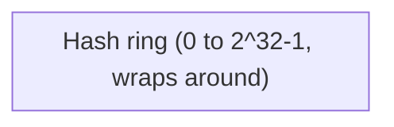
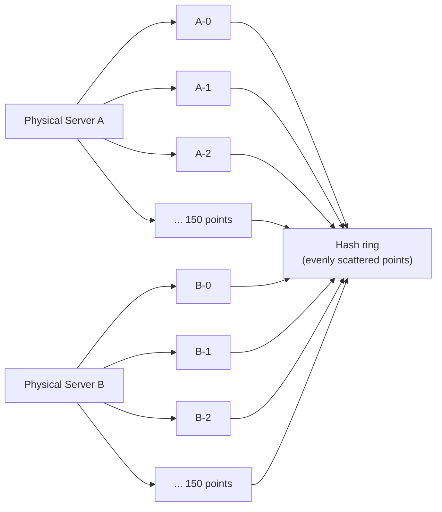

# Consistent Hashing

Consistent hashing is a technique for mapping keys to nodes (servers, shards, cache instances) such that adding or removing a node only remaps a small fraction of keys, instead of nearly all of them. It's the standard answer to "how do I distribute data across servers without a massive reshuffle every time the cluster size changes."

This note is a deep dive on one specific routing strategy referenced in [`scaling-db/sharding.md`](../scaling-db/sharding.md) — see that note for how consistent hashing fits alongside range, hash-modulo, tag/directory, and geo sharding as options for a shard key strategy.

## TL;DR
- **The problem**: naive `hash(key) % N` remaps almost every key when `N` changes — adding one server to a 4-node cluster moves ~80% of keys.
- **The fix**: arrange nodes and keys on a conceptual **ring** (a hash space that wraps around). A key belongs to the first node found walking clockwise from the key's position. Adding/removing a node only affects the keys between it and its neighbor — everything else stays put.
- **The catch**: with few real nodes, ring positions are uneven by chance, causing hot spots. Fixed with **virtual nodes (vnodes)** — each physical node gets many points on the ring, smoothing the distribution via the law of large numbers.
- **Used by**: DynamoDB, Cassandra, Riak, Memcached client-side sharding (ketama), CDN request routing, many load balancers.
- Replication on the ring: walk clockwise past the primary node and keep collecting the next N-1 *distinct physical* nodes as replicas.

## The problem: naive modulo hashing

The obvious way to shard `N` servers is `server = hash(key) % N`. This works fine as long as `N` never changes — but the moment you add or remove a server, `N` changes, and the modulo of nearly every key flips to a different value.

### Concrete example: 4 servers, add a 5th

Say you have 4 servers (`0, 1, 2, 3`) and route with `hash(key) % 4`. Ten keys land like this (using a simplified integer hash for illustration):

| Key | hash(key) | `% 4` (server) |
|---|---|---|
| A | 100 | 0 |
| B | 101 | 1 |
| C | 102 | 2 |
| D | 103 | 3 |
| E | 104 | 0 |
| F | 105 | 1 |
| G | 106 | 2 |
| H | 107 | 3 |
| I | 108 | 0 |
| J | 109 | 1 |

Now add a 5th server and route with `hash(key) % 5`:

| Key | hash(key) | `% 5` (server) | Same as before? |
|---|---|---|---|
| A | 100 | 0 | yes |
| B | 101 | 1 | **no** (was 1, still 1 — coincidence) |
| C | 102 | 2 | **no** (was 2, now 2 — coincidence) |
| D | 103 | 3 | **no** (was 3, now 3 — coincidence) |
| E | 104 | 4 | **no** (was 0, now 4) |
| F | 105 | 0 | **no** (was 1, now 0) |
| G | 106 | 1 | **no** (was 2, now 1) |
| H | 107 | 2 | **no** (was 3, now 2) |
| I | 108 | 3 | **no** (was 0, now 3) |
| J | 109 | 4 | **no** (was 1, now 4) |

Out of 10 keys, only a coincidental few stay in place — in general, **only about `1/N` of keys stay put, and `(N-1)/N` of them move**. Going from 4 to 5 servers means roughly 80% of keys get remapped. For a cache, that's an 80% cache-miss storm hitting your database simultaneously. For a database shard, that's a massive, mostly-unnecessary data migration — the vast majority of that movement is *pure churn*, not required by the actual change (one server added, four still exist).

This is the core motivation for consistent hashing: **make the fraction of remapped keys proportional to the size of the change, not the size of the cluster.**

## How consistent hashing works

### The hash ring

Instead of `hash(key) % N`, imagine the output space of the hash function (e.g., `0` to `2^32 - 1`) bent into a circle — position `2^32 - 1` wraps back around to `0`. This circle is the **ring**.

Both **servers** and **keys** are hashed into this same space and placed on the ring by their hash value. To find which server owns a given key: hash the key to get its ring position, then **walk clockwise** until you hit the first server. That server owns the key.



A clearer picture as an ASCII ring (positions simplified to 0-100 for readability):

```
                        0/100
                          |
              ServerD(90) |  ServerA(5)
                    \      |      /
                     \     |     /
        keyX(75)------\    |    /------ keyY(10)
                        \  |   /
                         \ |  /
    75 ------------------ RING ------------------ 25
                         / |  \
                        /  |   \
                       /   |    \
              ServerC(60) |    ServerB(35)
                          |
                         50
```

Walking **clockwise** (increasing position, wrapping at 100→0):
- `keyY` at position 10 walks clockwise and hits `ServerA` at position 5... wait — clockwise from 10 means increasing, so it continues to `ServerB` at 35. **`keyY` belongs to ServerB.**
- `keyX` at position 75 walks clockwise to `ServerD` at 90. **`keyX` belongs to ServerD.**

(The convention is: each node "owns" the arc of the ring from the previous node's position, exclusive, up to and including its own position — walking clockwise from the key lands on the first node encountered.)

### Worked example: adding a server

Ring with 4 servers at positions `10, 30, 60, 85` (out of 100). Keys are owned by the next server clockwise:

| Key position | Owner (walk clockwise) |
|---|---|
| 5 | Server@10 |
| 15 | Server@30 |
| 45 | Server@60 |
| 70 | Server@85 |
| 95 | Server@10 (wraps around) |

Now **add a 5th server at position 50**. Only keys that fall **between the previous server (30) and the new server (50)** get remapped — they used to belong to `Server@60` (the next one clockwise) and now belong to `Server@50` instead. Every other key's owner is unchanged.

| Key position | Owner before | Owner after adding Server@50 | Changed? |
|---|---|---|---|
| 5 | Server@10 | Server@10 | no |
| 15 | Server@30 | Server@30 | no |
| 45 | Server@60 | **Server@50** | **yes** |
| 70 | Server@85 | Server@85 | no |
| 95 | Server@10 | Server@10 | no |

Only 1 out of 5 keys moved — and critically, **it only moved because it genuinely now belongs to the new server**, not due to arbitrary reshuffling. In general, adding one node to a ring of `N` nodes remaps roughly `1/(N+1)` of the keys (only the keys in the arc now claimed by the new node) — a small, proportional, and *necessary* amount of movement, compared to the ~`(N-1)/N` catastrophic remap under modulo hashing.

Removing a server works the same way in reverse: its keys are absorbed by the next server clockwise, and nothing else moves.

## The hot-spot problem and virtual nodes

With only a handful of real servers placed on the ring by a single hash each, their positions are essentially random — and random points on a circle are **not evenly spaced**. Some servers end up owning huge arcs (lots of keys), others tiny slivers (almost no keys).

```
Naive placement — 4 servers, uneven arcs:

Server A owns: [huge arc, 45% of ring]
Server B owns: [tiny arc, 5% of ring]
Server C owns: [medium arc, 30% of ring]
Server D owns: [medium arc, 20% of ring]
```

Server A is now a hot spot — it's handling 9x the load of Server B, purely due to bad luck in where its single hash landed. This gets worse the fewer nodes you have (a 3-node ring has much higher variance than a 300-node ring).

### The fix: virtual nodes (vnodes)

Instead of hashing each physical server **once** onto the ring, hash it **many times** (with a distinguishing suffix, e.g. `serverA-0`, `serverA-1`, ..., `serverA-149`) — giving each physical server, say, 100-200 points scattered around the ring. A key still maps to whichever ring position is closest clockwise, but that position is now a *virtual* node that's mapped back to its owning physical server.

```
Physical Server A → hashed as: A-0(pos 12), A-1(pos 47), A-2(pos 81), A-3(pos 5), ... (150 points)
Physical Server B → hashed as: B-0(pos 23), B-1(pos 61), B-2(pos 90), B-3(pos 33), ... (150 points)
```

With enough virtual points per server, the **law of large numbers** takes over — the total arc length each physical server ends up owning converges toward `1/N` of the ring, because you're now averaging over hundreds of random samples per server instead of relying on a single random sample. More vnodes = smoother distribution, at the cost of more metadata (a bigger ring to store and search) and slightly more computation per lookup.



Rule of thumb from production systems: **100-200+ virtual nodes per physical node** gives good balance (Cassandra's default is 256, historically; newer versions favor fewer, more deliberately allocated tokens for better control). Too few vnodes (say, 3-5 per server) barely helps — you need enough samples for the averaging effect to actually kick in.

## Real systems that use it

| System | How it uses consistent hashing |
|---|---|
| **Amazon DynamoDB** | Partitions keys across storage nodes using consistent hashing with virtual nodes, as described in the original Dynamo paper — this was one of the techniques that popularized the approach in industry. |
| **Apache Cassandra** | Each node owns one or more token ranges on a ring (via vnodes); replicas for a key are placed on the next N-1 distinct nodes walking clockwise (see replication section below). |
| **Riak** | Directly inspired by Dynamo; uses a 160-bit consistent hash ring with vnodes for partition placement. |
| **Memcached client-side sharding (ketama)** | Memcached servers themselves know nothing about each other — the **client library** hashes cache keys onto a ring of memcached server hashes (the "ketama" algorithm) so that adding/removing a memcached instance from the client's config only invalidates a fraction of cached keys instead of all of them. |
| **CDN request routing** | CDNs route a request for a given resource/URL to one of many cache/edge servers using consistent hashing, so that adding or removing edge capacity doesn't invalidate the entire cache's key-to-server mapping. |
| **Load balancers** (e.g., some configurations of Maglev, HAProxy consistent-hash mode) | Route requests for the same client/session to the same backend server consistently, so backend pool changes (scaling up/down) disturb the minimum number of active sessions. |

## 🟢 Beginner: the core idea in code

A minimal ring with no virtual nodes yet — illustrates the mechanism, but will have the hot-spot problem described above.

```python
import bisect
import hashlib

def hash_fn(key: str) -> int:
    return int(hashlib.md5(key.encode()).hexdigest(), 16)

class BasicRing:
    def __init__(self):
        self.ring = {}          # hash position -> node name
        self.sorted_positions = []  # kept sorted for binary search

    def add_node(self, node: str):
        pos = hash_fn(node)
        self.ring[pos] = node
        bisect.insort(self.sorted_positions, pos)

    def remove_node(self, node: str):
        pos = hash_fn(node)
        self.sorted_positions.remove(pos)
        del self.ring[pos]

    def get_node(self, key: str) -> str:
        if not self.ring:
            raise Exception("Ring is empty")
        pos = hash_fn(key)
        idx = bisect.bisect(self.sorted_positions, pos)
        if idx == len(self.sorted_positions):
            idx = 0  # wrap around the ring
        return self.ring[self.sorted_positions[idx]]

ring = BasicRing()
ring.add_node("server-A")
ring.add_node("server-B")
ring.add_node("server-C")

print(ring.get_node("user:1234"))   # -> some server, deterministic
```

`bisect` gives an O(log N) lookup for "first node position >= key position" — this is the "walk clockwise" step, implemented as a binary search over sorted ring positions rather than a literal loop.

## 🟡 Intermediate: adding virtual nodes

```python
import bisect
import hashlib

def hash_fn(key: str) -> int:
    return int(hashlib.md5(key.encode()).hexdigest(), 16)

class ConsistentHashRing:
    def __init__(self, virtual_nodes: int = 150):
        self.virtual_nodes = virtual_nodes
        self.ring: dict[int, str] = {}
        self.sorted_positions: list[int] = []

    def _vnode_key(self, node: str, i: int) -> str:
        return f"{node}#{i}"

    def add_node(self, node: str):
        for i in range(self.virtual_nodes):
            pos = hash_fn(self._vnode_key(node, i))
            self.ring[pos] = node
            bisect.insort(self.sorted_positions, pos)

    def remove_node(self, node: str):
        for i in range(self.virtual_nodes):
            pos = hash_fn(self._vnode_key(node, i))
            self.sorted_positions.remove(pos)
            del self.ring[pos]

    def get_node(self, key: str) -> str:
        if not self.ring:
            raise Exception("Ring is empty")
        pos = hash_fn(key)
        idx = bisect.bisect(self.sorted_positions, pos)
        if idx == len(self.sorted_positions):
            idx = 0
        return self.ring[self.sorted_positions[idx]]

    def get_replicas(self, key: str, count: int) -> list[str]:
        """Return `count` distinct physical nodes, walking clockwise."""
        if not self.ring:
            raise Exception("Ring is empty")
        pos = hash_fn(key)
        idx = bisect.bisect(self.sorted_positions, pos)
        replicas = []
        seen = set()
        n = len(self.sorted_positions)
        for step in range(n):
            i = (idx + step) % n
            node = self.ring[self.sorted_positions[i]]
            if node not in seen:
                seen.add(node)
                replicas.append(node)
            if len(replicas) == count:
                break
        return replicas


# Demonstrate: how many keys move when a node is added?
ring = ConsistentHashRing(virtual_nodes=150)
for s in ["server-A", "server-B", "server-C", "server-D"]:
    ring.add_node(s)

keys = [f"user:{i}" for i in range(10000)]
before = {k: ring.get_node(k) for k in keys}

ring.add_node("server-E")
after = {k: ring.get_node(k) for k in keys}

moved = sum(1 for k in keys if before[k] != after[k])
print(f"{moved} / {len(keys)} keys moved ({moved/len(keys):.1%})")
# Expect roughly 1/5 = 20%, not ~80% like modulo hashing
```

Running this shows roughly `1/(N+1)` of keys move when adding the 5th node to a 4-node ring — matching the theory, and a night-and-day difference from modulo hashing's near-total remap.

## 🔴 Advanced: replication on the ring

Real distributed stores don't just route a key to one node — they replicate it to `N` nodes for durability. Consistent hashing gives a natural way to pick replica placement: **walk clockwise from the key's position and take the next N distinct physical nodes** (skipping repeated vnodes that map back to a physical node you've already counted).

```
Ring (clockwise): ... -> [B-vnode] -> [A-vnode] -> [C-vnode] -> [A-vnode] -> [D-vnode] -> ...
key X lands here: ^
Walking clockwise for 3 replicas: first hit = B, next distinct = A, next distinct = C
Replica set for key X = {B, A, C}   (D not included, only need 3)
```

This is exactly how **Cassandra** places replicas: the first node clockwise from the key is the primary "coordinator" for writes to that key, and the next `RF-1` (replication factor minus one) *distinct physical nodes* walking further clockwise hold the additional replicas. Because of virtual nodes, "walking clockwise" typically passes through several vnodes belonging to the same physical node before reaching a genuinely different one — hence the "distinct physical nodes" requirement in the algorithm above.

**Interaction with node failure**: if a physical node goes down, the keys it owned are inherited by the next node(s) clockwise — but because of vnodes, this failure's load isn't dumped onto just one neighbor; it's spread across whichever many distinct physical nodes owned adjacent virtual positions, further smoothing the impact of a single-node failure across the whole cluster rather than doubling the load on one unlucky neighbor.

**Bounded-load / consistent hashing variants**: plain consistent hashing (even with vnodes) can still let hash-based clustering cause moderate load imbalance under skewed key-access patterns (a few very hot keys). Extensions like **bounded-load consistent hashing** (Google's approach, used in some Envoy/Maglev-style load balancers) cap how much load any one node can take relative to average before overflow keys spill to the next node on the ring — trading a small amount of extra key movement for a hard guarantee on maximum load imbalance.

## Common pitfalls

- **Bad hash function**: a hash function with poor bit distribution (e.g., a naive sum-of-characters hash) clusters positions non-uniformly on the ring regardless of vnode count — use a well-distributed hash (MD5, MurmurHash, SHA-1 truncated) even though these aren't cryptographically important here, just statistically uniform.
- **Too few virtual nodes**: 3-10 vnodes per physical server barely reduces variance versus none at all — the averaging effect that fixes hot spots needs enough samples (100+) to kick in. Under-provisioning vnodes is a common cause of "we set up consistent hashing and it's still imbalanced."
- **Too many virtual nodes**: thousands of vnodes per node bloats ring metadata (memory, gossip/sync overhead in distributed systems that propagate ring state) for diminishing returns past a few hundred — there's a real cost, not just a knob to max out.
- **Forgetting distinct-physical-node dedup in replica placement**: naively walking clockwise and taking the next N *ring positions* (rather than N *distinct physical nodes*) can put multiple replicas of the same key on the same physical server if that server's vnodes happen to cluster — defeating the purpose of replication. Always dedupe by physical node identity when selecting replicas.
- **Assuming consistent hashing eliminates rebalancing entirely**: it minimizes movement, but the fraction that *does* move still needs to be physically copied to the new/remaining nodes — for large datasets this migration is still an operational event (bandwidth, time, temporary inconsistency) even if it's `1/(N+1)` of the data instead of `(N-1)/N`.
- **Using it where a simpler strategy would do**: if your cluster size is fixed and never changes, or if you need range queries (e.g., "give me all users with ID between X and Y"), plain hashing or range-based sharding may be simpler and consistent hashing's main benefit (cheap resizing) buys you nothing — see [`scaling-db/sharding.md`](../scaling-db/sharding.md) for the full comparison of sharding strategies and when each applies.

## Further reading

- [Karger et al., "Consistent Hashing and Random Trees" (1997)](https://www.cs.princeton.edu/courses/archive/fall09/cos518/papers/chash.pdf) — the original paper, introduced for web cache load distribution.
- [DeCandia et al., "Dynamo: Amazon's Highly Available Key-value Store" (2007)](https://www.allthingsdistributed.com/files/amazon-dynamo-sosp2007.pdf) — the paper that popularized consistent hashing with virtual nodes in industry practice; also covers vector clocks, quorum reads/writes, and gossip-based membership.
- [Cassandra documentation — data distribution and replication](https://cassandra.apache.org/doc/latest/cassandra/architecture/dynamo.html)
- [Google Research — "Consistent Hashing with Bounded Loads"](https://research.google/pubs/consistent-hashing-with-bounded-loads/)
- [`scaling-db/sharding.md`](../scaling-db/sharding.md) — how consistent hashing fits among other shard-key strategies (range, hash-modulo, tag/directory, geo).
