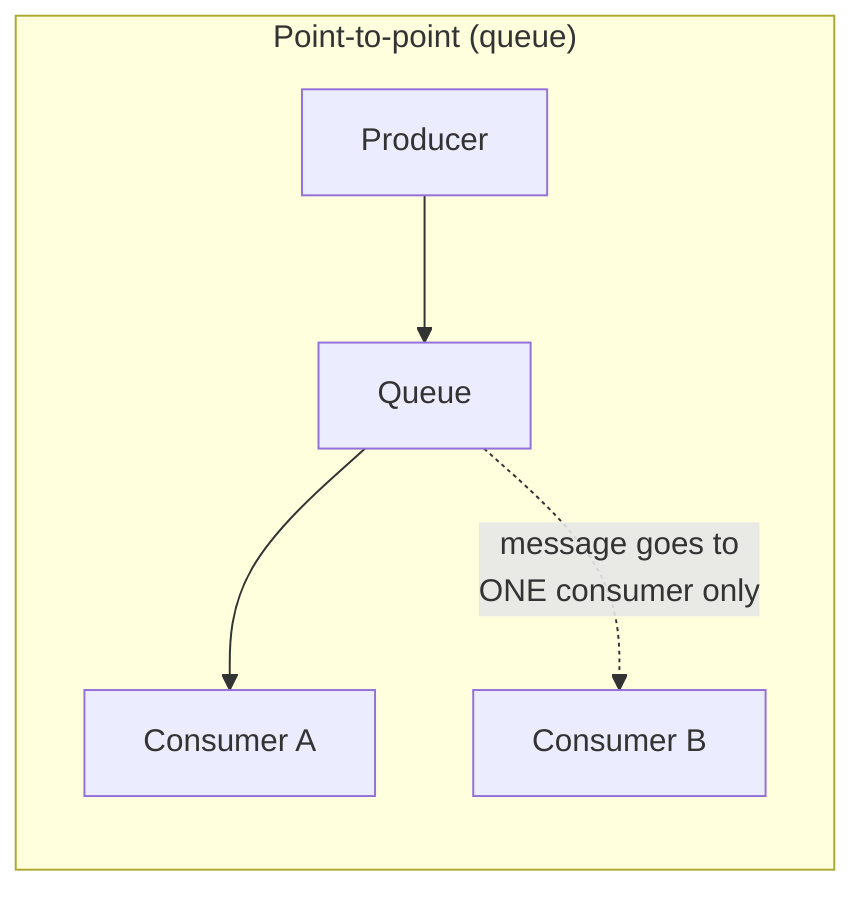
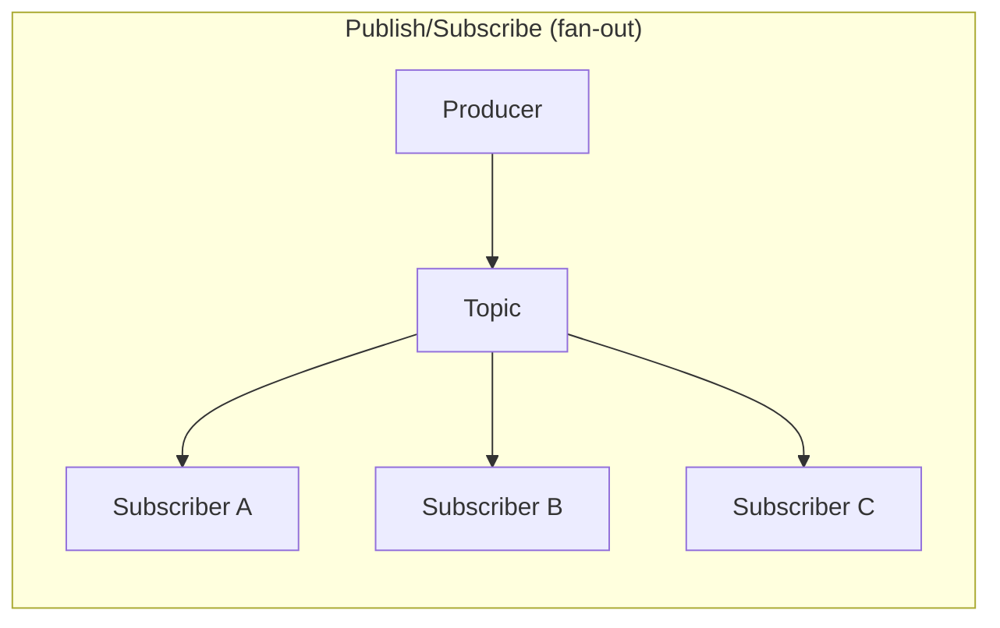

# Message Queues and Event-Driven Architecture

A message queue lets one part of a system hand work to another part *without both being up, fast, and available at the same instant*. That decoupling is the entire point — everything else (brokers, partitions, delivery guarantees) exists in service of it.

## TL;DR
- **Problem solved**: decoupling producers from consumers in time and space, absorbing load spikes, enabling async processing, and surviving partial failures without losing work.
- **Queue (point-to-point)**: each message consumed by exactly one worker — for distributing work. **Pub/Sub (fan-out)**: each message delivered to every subscriber — for broadcasting events. Mixing these up is the most common conceptual error.
- Delivery semantics: **at-most-once** (may lose messages), **at-least-once** (may duplicate, the common default), **exactly-once** (very hard, usually "effectively-once" via dedup + idempotency).
- Because at-least-once is the practical norm, **consumers must be idempotent** — processing the same message twice must be safe.
- **RabbitMQ** = smart broker, dumb consumer, routing via exchanges. **Kafka** = dumb broker (append-only log), smart consumer, replay and massive throughput. Pick based on whether you need routing flexibility or a durable replayable log.
- **Event Sourcing** stores state as an immutable sequence of events instead of current-state rows; **CQRS** splits the write model from the read model. They're independent patterns that pair well together.
- **Saga pattern** replaces distributed transactions (no 2PC across services) with a sequence of local transactions plus compensating actions on failure — choreography (event-driven, decentralized) or orchestration (a central coordinator).

## The problem queues solve

Without a queue, a producer calling a consumer directly (synchronous HTTP, RPC) couples them tightly:

- **Availability coupling**: if the consumer is down, the producer's request fails too.
- **Latency coupling**: the producer blocks until the consumer finishes, even if the consumer's work takes 10 seconds and the producer only needed to hand off data.
- **Load coupling**: a burst of traffic on the producer becomes a burst of traffic the consumer must absorb *right now*, even if it can only sustainably handle a lower steady rate.
- **Scaling coupling**: producer and consumer must scale together, even though they may have wildly different resource profiles (e.g., a lightweight API accepting uploads vs. a GPU-heavy video transcoder).

A message queue sits between them as a buffer:

```
Producer ---> [ Queue / Broker ] ---> Consumer
   (fast, fire-and-forget)      (processes at its own pace)
```

This buys four concrete things:

1. **Decoupling**: producer and consumer don't need to know about each other, don't need to be online simultaneously, and can be written in different languages, deployed independently, and scaled independently.
2. **Load buffering (leveling)**: a traffic spike piles up in the queue instead of crashing the consumer. The queue smooths a bursty arrival rate into a steady processing rate.
3. **Async processing**: the producer returns immediately after enqueueing ("task accepted") instead of waiting for the work to finish — critical for anything slow (sending emails, generating reports, resizing images, calling a flaky third-party API).
4. **Reliability**: if a consumer crashes mid-processing, a well-designed queue keeps the message around (unacknowledged) so another consumer (or a retry) can pick it up — work isn't silently lost the way it would be if it only existed in a crashed process's memory.

## Core concepts

| Term | Meaning |
|---|---|
| **Producer** | The service/process that creates and sends messages. |
| **Consumer** | The service/process that reads and processes messages. |
| **Broker** | The middleman server that stores messages and routes them (RabbitMQ, Kafka, SQS). |
| **Queue** | A buffer of messages, typically consumed by one consumer per message (point-to-point). |
| **Topic** | A named channel that consumers subscribe to; often supports fan-out (pub/sub). |
| **Message** | The unit of data sent — a payload plus metadata (timestamp, headers, routing key). |
| **Acknowledgment (ack)** | Consumer tells the broker "I successfully processed this" so it can be removed/marked done. |
| **Dead letter queue (DLQ)** | Where messages go after repeated processing failures, so they don't block the queue or get silently dropped. |

### Delivery semantics

This is the single most commonly misunderstood area of messaging systems.

| Semantic | Guarantee | Failure mode | How it's achieved |
|---|---|---|---|
| **At-most-once** | Message delivered zero or one times | Messages can be **lost** | Fire-and-forget, no retry, no persistence (e.g. Redis Pub/Sub, UDP-style) |
| **At-least-once** | Message delivered one or more times | Messages can be **duplicated** | Broker keeps message until consumer acks; if ack is lost/times out, redeliver |
| **Exactly-once** | Message delivered and processed exactly once | Very hard to achieve end-to-end | Idempotency keys + dedup, or transactional/idempotent writes tied to offset commits |

**Why exactly-once is genuinely hard**: the fundamental issue is that "processing a message" and "acknowledging that you processed it" are two separate operations that can fail independently. Consider the sequence: consumer reads message → consumer does work (e.g., writes to a database) → consumer acks the broker. There are three places this can break:

1. Consumer crashes **after doing the work** but **before acking** → broker redelivers → work is done twice.
2. Consumer crashes **while acking** (ack sent but network drops the confirmation) → broker doesn't know it succeeded → redelivers → work is done twice.
3. Consumer acks **before finishing the work** and then crashes → message is marked done but the work never actually completed → **message is lost**.

There is no way to make "do the work" and "acknowledge the message" a single atomic operation across two separate systems (the broker and whatever the consumer is writing to) without extra coordination. This is really the same problem as the [two-generals problem](https://en.wikipedia.org/wiki/Two_Generals%27_Problem) — no amount of protocol cleverness eliminates the ambiguity of a message that might or might not have arrived.

What real systems do instead of true exactly-once:

- **Kafka's idempotent producer + transactions**: guarantees exactly-once *within Kafka* (producer → topic → consumer offset commit, if the consumer also writes back to Kafka) via producer IDs and sequence numbers that dedupe retries, plus transactional writes that atomically commit both the output message and the input offset. This does **not** extend to arbitrary external side effects (e.g., calling a payment API) — only to Kafka-to-Kafka pipelines.
- **Idempotent consumers** (the general-purpose fix, works everywhere): design the *processing* to be safe under duplicate delivery, rather than trying to prevent duplicates from ever occurring. E.g., use the message's unique ID as a database primary key or `UPSERT` key — writing the same message twice becomes a no-op the second time.
- **Deduplication tables**: consumer keeps a "seen message IDs" store (Redis set, DB table with TTL) and checks it before processing — same idea as the `Idempotency-Key` pattern in REST APIs.

**The pragmatic takeaway**: assume at-least-once delivery, and make your consumer logic idempotent. This is simpler and more robust than chasing "true" exactly-once, and it's what virtually every production system actually does.

### Idempotent consumers in practice

```python
def handle_order_created(message):
    event_id = message["event_id"]  # unique per event, set by producer

    # Deduplication check — same idea as REST idempotency keys
    if dedup_store.exists(event_id):
        return  # already processed, safe no-op

    with db.transaction():
        # UPSERT instead of INSERT — safe if this runs twice
        db.execute("""
            INSERT INTO orders (id, status, total)
            VALUES (%s, %s, %s)
            ON CONFLICT (id) DO NOTHING
        """, (message["order_id"], "created", message["total"]))
        dedup_store.set(event_id, ttl=86400)

    ack(message)
```

Key principle: **make writes naturally idempotent** (`UPSERT`, "set balance to X" instead of "add X to balance", conditional writes keyed on a unique event ID) rather than relying purely on a dedup cache, since the cache itself can fail or expire.

### Message ordering

Ordering guarantees vary a lot by system and by configuration:

- **Single queue, single consumer**: strict FIFO is natural.
- **Single queue, multiple consumers**: ordering is **not** guaranteed across consumers — message A might be picked up by worker 1 and message B (sent after A) by worker 2, and worker 2 might finish first.
- **Kafka**: ordering is guaranteed **only within a partition**. Messages with the same partition key are always in order; messages across partitions have no ordering relationship. This is why partition key choice matters (see below).
- **SQS Standard**: best-effort ordering, not guaranteed. **SQS FIFO**: strict ordering, but only within a `MessageGroupId`, and at the cost of lower throughput.

### Dead letter queues (DLQ)

A DLQ is where messages go after they fail processing repeatedly (exceeding a max-retry count) instead of being retried forever or silently dropped. This exists because of **poison messages** — a message that is malformed, references data that no longer exists, or triggers a bug, so every consumer that tries it crashes or errors, and it gets redelivered forever, blocking the queue behind it (head-of-line blocking) or burning CPU in an infinite retry loop.

```
Queue ---> Consumer ---(fails)---> retry (1) ---(fails)---> retry (2) ---(fails)---> DLQ
                                                                                       |
                                                                          alerting, manual inspection,
                                                                          reprocessing after a fix
```

A DLQ turns "the queue is silently stuck" or "we lost a message and don't know it" into "here's a visible, inspectable pile of messages that need attention" — an operational safety net, not a fix for the underlying bug.

## Queue vs Pub/Sub model

This distinction trips people up constantly because both use "topics" or "queues" as vocabulary, but the delivery semantics are fundamentally different.





| | Point-to-point (queue) | Publish/Subscribe (fan-out) |
|---|---|---|
| **Delivery** | Each message consumed by exactly **one** consumer | Each message delivered to **every** subscriber |
| **Purpose** | Distribute work across a pool of workers (load balancing) | Broadcast an event/notification to multiple independent interested parties |
| **Scaling model** | Add more consumers to increase throughput; they compete for messages | Add more subscribers to add more *independent reactions*, doesn't increase throughput of any one |
| **Example** | A pool of workers processing image-resize jobs from one queue | An "order placed" event triggering email service, analytics service, and fraud-check service simultaneously |
| **Real systems** | SQS Standard, RabbitMQ queue with one consumer group | SNS, Redis Pub/Sub, Kafka (via multiple consumer groups), RabbitMQ fanout exchange |

The confusing part: **Kafka topics can act as either**, depending on consumer group configuration:
- If all consumers share one consumer group → behaves like a **queue** (each message goes to one consumer in the group, load is distributed).
- If consumers are in different consumer groups → behaves like **pub/sub** (each group gets its own full copy of every message).

## Real systems compared

### RabbitMQ (AMQP)

RabbitMQ is a **traditional message broker** implementing AMQP (Advanced Message Queuing Protocol). It's a "smart broker, dumb consumer" model — the broker does routing logic, consumers just receive what's routed to them.

Core components:
- **Producer** publishes a message to an **exchange** (not directly to a queue).
- **Exchange** routes the message to one or more **queues** based on **bindings** and a **routing key**.
- **Queue** holds messages until a consumer acks them; once acked, the message is **deleted**.
- **Consumer** subscribes to a queue and receives messages.

```
Producer --> [ Exchange ] --binding--> [ Queue A ] --> Consumer 1
                   |
                   +--binding--> [ Queue B ] --> Consumer 2
```

**Exchange types** (this is the routing flexibility RabbitMQ is known for):

| Exchange type | Routing behavior | Example use |
|---|---|---|
| **Direct** | Routes to queues whose binding key exactly matches the message's routing key | `routing_key="payment.failed"` goes only to queues bound to `payment.failed` |
| **Fanout** | Ignores routing key, broadcasts to all bound queues | Broadcast a "cache invalidate" event to every service instance |
| **Topic** | Pattern-matches routing key against wildcard bindings (`*` = one word, `#` = zero or more words) | `logs.*.error` matches `logs.auth.error` but not `logs.auth.warn.retry` |
| **Headers** | Routes based on message header key/value pairs instead of the routing key | Route based on multiple attributes at once (e.g., `region=eu AND priority=high`) |

Once a message is consumed and acked, RabbitMQ **deletes it** — there's no built-in replay. This is the key philosophical difference from Kafka.

### Apache Kafka

Kafka is a **distributed commit log**, not a traditional queue. It's "dumb broker, smart consumer" — Kafka just appends messages to a log and lets consumers track their own read position; it doesn't do per-message routing decisions.

Core concepts:
- **Topic**: a named log, split into **partitions** for parallelism.
- **Partition**: an ordered, immutable, append-only sequence of messages, each with a monotonically increasing **offset**. Ordering is guaranteed *within* a partition only.
- **Producer**: writes to a topic; can specify a **partition key** — messages with the same key always land on the same partition (this is how you get per-key ordering, e.g. all events for `user_id=42` stay in order).
- **Consumer group**: a set of consumers that split the partitions of a topic between them — each partition is read by exactly one consumer *within* a group, but the same topic can be read independently by multiple groups.
- **Retention**: unlike RabbitMQ, messages are **not deleted on consumption**. They stay in the log for a configured retention period (e.g., 7 days) or until a size limit, regardless of whether anyone has read them. This is what enables **replay** — a new consumer, or an existing one recovering from a bug, can rewind and reprocess history.

```
Topic "orders" (3 partitions)
┌─────────────────────────────────────────────┐
│ Partition 0: [msg0][msg1][msg2][msg3] ──────>│  offset increases →
│ Partition 1: [msg0][msg1][msg2] ─────────────>│
│ Partition 2: [msg0][msg1][msg2][msg3][msg4] ─>│
└─────────────────────────────────────────────┘
        ^                    ^
   Consumer Group A     Consumer Group B
   (3 consumers,        (1 consumer, reads
    1 per partition)     all 3 partitions)
```

**Consumer group mechanics**:
- If a consumer group has fewer consumers than partitions, some consumers read multiple partitions.
- If a consumer group has more consumers than partitions, the extras sit idle — you cannot have more than one consumer per partition within the same group (this caps your parallelism at partition count).
- When a consumer joins or leaves a group, Kafka triggers a **rebalance**, reassigning partitions among the remaining group members.
- Each group tracks its own **committed offset** per partition — this is how Kafka supports both "queue-like" behavior (one group) and "pub/sub-like" behavior (multiple independent groups) on the same topic.

Kafka trades RabbitMQ's flexible routing for raw throughput, durability, and replay — it's built for high-volume event streams (clickstreams, logs, metrics, CDC feeds) rather than fine-grained per-message routing rules.

### Redis Pub/Sub vs Redis Streams

Two very different things that both live in Redis and get confused:

| | Redis Pub/Sub | Redis Streams |
|---|---|---|
| **Persistence** | None — fire-and-forget | Persisted (append-only log, similar model to Kafka) |
| **Delivery if subscriber offline** | Message is **lost** | Message stays in the stream, consumer can catch up |
| **Consumer groups** | No | Yes (`XREADGROUP`), similar to Kafka's model |
| **Replay** | No | Yes, via stream IDs |
| **Use case** | Ephemeral real-time notifications (e.g., "someone typed" indicator) where losing a message is fine | Durable event log, task queues, where losing messages is not acceptable |

Redis Pub/Sub is **at-most-once** by nature — if no one is listening when you publish, the message vanishes. Redis Streams was added specifically to fix this and bring Kafka-like durability and consumer-group semantics to Redis.

### AWS SQS and SNS

- **SQS (Simple Queue Service)**: a managed point-to-point queue.
  - **Standard queue**: at-least-once delivery, best-effort ordering, nearly unlimited throughput, can occasionally deliver duplicates or slightly out of order.
  - **FIFO queue**: exactly-once processing (via dedup ID) and strict ordering *within a `MessageGroupId`*, but capped throughput (300 msg/sec by default, up to 3000/sec batched).
- **SNS (Simple Notification Service)**: managed pub/sub — publishes fan out to multiple subscribers (SQS queues, Lambda functions, HTTP endpoints, email). Commonly paired as **"SNS fan-out to SQS"**: one SNS topic publishes an event, multiple SQS queues each get their own durable copy for independent processing by different services.

```
Producer --> SNS Topic --+--> SQS Queue (email service)   --> Consumer
                          +--> SQS Queue (analytics)        --> Consumer
                          +--> SQS Queue (fraud detection)   --> Consumer
```

### Comparison table

| System | Model | Persistence | Ordering | Replay | Best for |
|---|---|---|---|---|---|
| **RabbitMQ** | Point-to-point + flexible routing (exchanges) | Until acked, then deleted | Per-queue FIFO | No | Complex routing, task queues, RPC-style messaging |
| **Kafka** | Log-based, partitioned | Retained regardless of consumption (time/size based) | Per-partition only | Yes (rewind offsets) | High-throughput event streaming, event sourcing, log aggregation |
| **Redis Pub/Sub** | Pub/sub, fire-and-forget | None | Best-effort | No | Ephemeral real-time signals, low-stakes broadcast |
| **Redis Streams** | Log-based, consumer groups | Persisted | Per-stream | Yes | Lightweight durable queue when you already run Redis |
| **SQS Standard** | Point-to-point, managed | Until deleted (visibility timeout) | Best-effort | No (not designed for it) | Simple decoupled task queues on AWS |
| **SQS FIFO** | Point-to-point, managed, ordered | Until deleted | Strict, per group ID | No | Ordered processing where duplicates/reordering are unacceptable |
| **SNS** | Pub/sub, managed | None (delivery only) | N/A | No | Fan-out notifications to multiple downstream systems |

## Event-driven patterns

### Event sourcing

**The problem it solves**: traditional systems store only the *current state* of a row (`UPDATE orders SET status='shipped' WHERE id=123`), which throws away history. You can't answer "what was the state at 3pm yesterday," "how did it get here," or "what if we replay this differently" — that information is gone the moment the `UPDATE` runs.

**The idea**: instead of storing current state, store the full sequence of **events** that led to that state. Current state becomes a *derived, replayable* value — you compute it by folding over the event log, rather than storing it directly.

```
Traditional (state-based):
  orders table: { id: 123, status: "shipped", total: 4999 }
  (previous states are gone)

Event-sourced:
  event log for order 123:
    1. OrderCreated   { total: 4999 }
    2. PaymentReceived { amount: 4999 }
    3. OrderShipped    { carrier: "fedex", tracking: "1Z..." }

  current state = fold(events) = { id: 123, status: "shipped", total: 4999, tracking: "1Z..." }
```

```python
# Simplified event-sourced order aggregate
events = [
    {"type": "OrderCreated", "total": 4999},
    {"type": "PaymentReceived", "amount": 4999},
    {"type": "OrderShipped", "carrier": "fedex"},
]

def replay(events):
    state = {"status": "new"}
    for e in events:
        if e["type"] == "OrderCreated":
            state.update(status="created", total=e["total"])
        elif e["type"] == "PaymentReceived":
            state["status"] = "paid"
        elif e["type"] == "OrderShipped":
            state.update(status="shipped", carrier=e["carrier"])
    return state

current_state = replay(events)
# {'status': 'shipped', 'total': 4999, 'carrier': 'fedex'}
```

Benefits: full audit trail for free, the ability to reconstruct state at any point in time, and the ability to **replay** events into a different projection later (e.g., rebuild a new read-optimized table after a bug fix, or feed the same events into a new analytics system that didn't exist when the events were originally recorded).

Costs: querying "current state" directly requires replaying events (mitigated by periodic **snapshots** — a cached fold-result at a point in time, so you only replay events since the last snapshot) and the event schema becomes a long-term compatibility contract, since old events must still be replayable years later.

### CQRS (Command Query Responsibility Segregation)

**The problem it solves**: a single data model optimized for both writes (normalized, transactional, consistency-focused) and reads (often needs denormalized, aggregated, differently-shaped data for fast queries) forces compromises in both directions. A `GET /orders/123/summary` endpoint might need data joined from five tables, while the write path just needs one row inserted — using the same schema for both is often suboptimal for one or the other.

**The idea**: split the **write model** (commands: create, update, delete) from the **read model** (queries: fetch, list, search) — they can use entirely different data stores, shapes, and even technologies.

```
                 ┌─────────────┐
  Commands  ───> │ Write Model │ ───> events published
  (writes)       │ (normalized)│
                 └─────────────┘
                        |
                        v
                 event stream / sync process
                        |
                        v
                 ┌─────────────┐
  Queries   <─── │ Read Model  │
  (reads)        │ (denormalized,
                 │  query-optimized)
                 └─────────────┘
```

Example: an order system's write side is a normalized relational schema (`orders`, `order_items`, `payments` tables) enforcing transactional integrity. Every write also emits an event. A separate read-side service consumes those events and maintains a denormalized `order_summary` document in Elasticsearch or a Mongo collection — pre-joined, pre-aggregated, optimized purely for the "show me this customer's order history fast" query pattern. The read model can lag slightly behind the write model (eventual consistency) in exchange for much faster, simpler reads.

### Event sourcing + CQRS together

They're **independent patterns** — you can use either alone — but they pair naturally: event sourcing gives you a durable log of *what happened*; CQRS gives you the freedom to build as many differently-shaped read models from that log as you need, each optimized for a specific query pattern, without touching the write model or the event log itself.

```
Commands --> Write Model --> Event Log (event-sourced)
                                  |
                  +---------------+---------------+
                  |               |                |
                  v               v                v
           Read Model A    Read Model B     Read Model C
         (order summary)  (analytics DB)   (search index)
```

If a read model has a bug or you want a new one, you don't migrate data — you just replay the event log into a fresh projection.

## The saga pattern

**The problem**: in a monolith, a multi-step business operation (place an order → charge payment → reserve inventory → schedule shipping) can be one ACID database transaction — all-or-nothing. In microservices, each step usually lives in a **different service with its own database**, so a single distributed ACID transaction (two-phase commit, 2PC) across all of them is generally avoided in practice — it requires all participants to be available and locks resources across services for the duration, which kills availability and doesn't play well with the "services fail independently" reality of distributed systems.

**The idea**: replace one distributed transaction with a **sequence of local transactions**, each committed independently, where every step that changes state has a corresponding **compensating transaction** that undoes it if a later step fails.

### Example: e-commerce checkout

Steps: `Payment Service` charges the card → `Inventory Service` reserves stock → `Shipping Service` schedules delivery.

Happy path:
```
1. Payment Service:  charge $50           --> success
2. Inventory Service: reserve 1 unit       --> success
3. Shipping Service:  schedule delivery    --> success
                                            === order complete ===
```

Failure path — shipping fails after payment and inventory already succeeded:
```
1. Payment Service:  charge $50            --> success
2. Inventory Service: reserve 1 unit        --> success
3. Shipping Service:  schedule delivery     --> FAILS (no delivery slots)

Compensating actions run in reverse:
4. Inventory Service: release reserved unit (compensate step 2)
5. Payment Service:  refund $50             (compensate step 1)
```

Each individual step is a normal local ACID transaction against that service's own database. There's no lock held across services and no single coordinator required to hold the whole operation open — the tradeoff is that the system passes through **intermediate, temporarily-inconsistent states** (money charged, but order not yet confirmed) that must be an accepted and designed-for part of the business logic, not an edge case swept under the rug.

### Choreography vs orchestration

**Choreography** — no central coordinator; each service listens for events and reacts, publishing its own event in turn.

```
PaymentService --publishes--> "PaymentCompleted"
       |
       v (InventoryService subscribes)
InventoryService --publishes--> "InventoryReserved"
       |
       v (ShippingService subscribes)
ShippingService --publishes--> "ShippingScheduled" or "ShippingFailed"
       |
       v (on failure, InventoryService and PaymentService each
          subscribe to "ShippingFailed" and run their own compensation)
```

| | Pros | Cons |
|---|---|---|
| **Choreography** | Simple for a few steps, no single point of failure, services stay loosely coupled | Hard to see/debug the overall flow ("who reacts to what" is scattered across services), risk of circular event dependencies, adding a step means touching multiple services |

**Orchestration** — a central **saga orchestrator** explicitly calls each service in sequence and decides what to do on failure.

```
                     ┌───────────────────┐
                     │ Saga Orchestrator  │
                     └───────────────────┘
                       |    |    |    |
              1. call  |    |    |    | 4. on failure, call compensating
              Payment  |    |    |    |    actions in reverse order
                       v    v    v    v
                 Payment  Inventory  Shipping
                 Service  Service    Service
```

```python
# Simplified orchestrator pseudocode
def checkout_saga(order):
    try:
        payment = payment_service.charge(order.total)
        try:
            inventory_service.reserve(order.items)
            try:
                shipping_service.schedule(order)
            except ShippingError:
                inventory_service.release(order.items)   # compensate step 2
                payment_service.refund(payment)            # compensate step 1
                raise
        except InventoryError:
            payment_service.refund(payment)                # compensate step 1
            raise
    except PaymentError:
        mark_order_failed(order)
```

| | Pros | Cons |
|---|---|---|
| **Orchestration** | Explicit, centralized, easy to trace/debug/visualize the whole flow, easier to add new steps | The orchestrator is a new component to build and can become a bottleneck or single point of coordination logic (though not necessarily a SPOF if made stateless/restartable) |

**Rule of thumb**: choreography for 2-3 simple steps with low coupling needs; orchestration once you have several steps, need clear visibility into "where did this order get stuck," or need complex conditional branching in the compensation logic. Real systems (Uber's trip lifecycle, most large e-commerce checkouts) tend to gravitate toward orchestration as step count grows, because debugging a choreographed saga in production — tracing an event chain across a dozen services — gets painful fast.

## 🟢 Beginner

**Why decouple at all?** Imagine an API endpoint that, on signup, sends a welcome email directly:

```python
# Tightly coupled — bad
def signup(user_data):
    user = create_user(user_data)
    send_welcome_email(user.email)  # blocks the request; if email service is down, signup fails
    return user
```

If the email provider is slow or down, signup itself fails or hangs — even though sending a welcome email has nothing to do with whether the account was created successfully.

```python
# Decoupled via a queue — good
def signup(user_data):
    user = create_user(user_data)
    queue.publish("user.created", {"user_id": user.id, "email": user.email})
    return user  # returns immediately, doesn't wait on email

# Separate consumer process, running independently
def email_worker():
    for message in queue.consume("user.created"):
        send_welcome_email(message["email"])
        message.ack()
```

Now: signup is fast and doesn't fail because of an unrelated system; the email worker can be scaled, restarted, or even be temporarily down without breaking signups (messages just queue up); and adding a second consumer (e.g., "also add this user to the CRM") means subscribing another worker to the same event, with zero changes to the signup code.

## 🟡 Intermediate

**Kafka partition and consumer group mechanics, concretely**: say a topic `orders` has 4 partitions, and you key messages by `user_id`. All events for a given user always land in the same partition (`hash(user_id) % num_partitions`), which guarantees per-user ordering.

- Consumer group `analytics` has 2 consumers → each consumer reads 2 partitions.
- Consumer group `fulfillment` has 4 consumers → each reads exactly 1 partition (max useful parallelism for this topic).
- Consumer group `fulfillment` has 6 consumers → 2 sit completely idle (partition count is a hard ceiling on active-consumer parallelism within one group). To use more consumers, add more partitions — but this is a topic reconfiguration, and increasing partition count later can change which partition existing keys hash to, temporarily breaking per-key ordering guarantees during the transition.

**RabbitMQ exchange choice in practice**: a `topic` exchange with routing keys like `order.created`, `order.shipped.us`, `order.shipped.eu` lets one consumer bind to `order.shipped.*` (all shipped events regardless of region) while another binds to `order.shipped.eu` (only EU shipments) — same exchange, same messages, different subsets routed to different queues based on pattern matching, without the producer knowing or caring who's listening.

## 🔴 Advanced

**Consumer lag**: the gap between the latest message offset in a partition and the offset a consumer group has actually committed. Rising lag means the consumer can't keep up with the producer's rate — either scale out consumers (up to the partition-count ceiling), speed up per-message processing, or accept a growing backlog. Lag is the primary health metric for a Kafka pipeline; monitoring tools (Burrow, Kafka's own consumer group APIs, Datadog/Grafana dashboards) alert on it directly.

**Backpressure**: what happens when consumers can't keep up with producers. Options:
- **Buffer and grow** (the queue absorbs it) — fine short-term, dangerous unbounded (see pitfalls below).
- **Producer-side throttling**: the producer slows down or rejects new work once queue depth crosses a threshold (e.g., returning 503 upstream, or applying a rate limit).
- **Load shedding**: drop lower-priority messages under pressure rather than let the queue grow unbounded.
- **Autoscaling consumers**: add more consumer instances reactively based on lag (common in Kubernetes-based worker pools, keyed off a lag metric via KEDA or similar).

**Poison messages**: a message that will *never* succeed no matter how many times it's retried (malformed payload, references a deleted foreign key, triggers a deserialization bug). Left unhandled, it either loops forever (burning resources, and in ordered systems, **blocking every message behind it** since the consumer can't move past the stuck offset/message) or crash-loops the consumer. Fix: bounded retry count with exponential backoff, then route to a DLQ automatically.

**Replay from the Kafka log**: because Kafka retains messages regardless of consumption, you can reset a consumer group's committed offset backward (`kafka-consumer-groups --reset-offsets --to-earliest`) and reprocess history — invaluable for recovering from a bug in the consumer logic (fix the bug, replay the last week of events to rebuild correct downstream state) or bootstrapping a brand-new service that needs historical context. This capability is fundamentally what a traditional delete-on-ack queue (RabbitMQ, SQS) cannot offer once a message has been consumed.

**Exactly-once in practice, revisited**: Kafka's transactional producer API (`initTransactions`, `beginTransaction`, `commitTransaction`) can atomically write output messages and commit input offsets as one unit, giving exactly-once *semantics for Kafka-to-Kafka stream processing* (e.g., Kafka Streams apps). The moment your pipeline touches something outside Kafka's transactional boundary — a REST call, a non-transactional database write — you're back to at-least-once plus idempotency as your only real tool.

## Common pitfalls

- **Assuming ordering across partitions/consumers**: ordering is only guaranteed within a single partition (Kafka) or a single queue with one consumer (RabbitMQ/SQS). Scaling out consumers for throughput inherently sacrifices global ordering — if you need strict global order, you can only have one consumer, which caps throughput.
- **Consumer crashes mid-processing → duplicate delivery**: if a consumer dies after doing the work but before acking, the broker redelivers to another consumer — the work runs twice. This is not a bug in the broker, it's the fundamental shape of at-least-once delivery. The only fix is idempotent processing, not "try to prevent it."
- **Unbounded queue growth**: if consumers permanently can't keep up with producers (not just a temporary spike), the queue grows forever — eventually exhausting broker disk/memory, causing broker-wide outages that affect *unrelated* topics/queues sharing that broker. Set max queue length / retention limits, alert on rising lag, and treat "queue depth trending up with no ceiling" as an incident, not background noise.
- **Treating a queue as a database**: queues are for transit, not long-term storage or as a query interface. If you find yourself needing to search, filter, or randomly access "what's in the queue," that's a sign you actually need a database (possibly fed by the queue).
- **Ignoring message size limits**: most brokers cap message size (SQS: 256KB, Kafka default: 1MB per message). Sending large payloads (e.g., a full image) directly through the queue breaks or degrades performance — the standard fix is to put the payload in object storage (S3) and send just a reference/URL through the queue (the "claim check" pattern).
- **No DLQ / no max retry count**: without a bound, a poison message retries forever, burning resources and potentially blocking ordered processing behind it indefinitely.
- **Forgetting the DLQ needs monitoring**: a DLQ that nobody looks at is just a slower, quieter way to lose messages — set up alerting on DLQ depth, not just on the main queue.

## Real-world examples

- **Uber's trip event pipeline**: trip lifecycle events (requested, matched, started, completed) flow through Kafka to dozens of downstream consumers — pricing, ETA calculation, fraud detection, analytics, driver payouts — each an independent consumer group reading the same event stream without coupling to each other or to the trip service itself.
- **Netflix**: uses Kafka extensively for its data pipeline backbone — over a trillion messages/day at peak, feeding real-time analytics, personalization/recommendation pipelines, and operational monitoring, chosen specifically for its ability to handle massive fan-out (many consumer groups on the same stream) and replay for backfilling new consumers.
- **LinkedIn** (Kafka's birthplace): originally built to unify activity-stream data (page views, clicks) and operational metrics into one pipeline, replacing a sprawl of point-to-point integrations between systems.
- **Stripe**: uses idempotency keys pervasively (see `api/restapi.md`) precisely because webhook and event delivery is at-least-once — the same event can and does arrive more than once, and consumers are expected to dedupe.

## Further reading

- [Kafka: The Definitive Guide](https://www.confluent.io/resources/kafka-the-definitive-guide/) — Confluent's free book, the standard reference.
- [Enterprise Integration Patterns](https://www.enterpriseintegrationpatterns.com/) (Hohpe & Woolf) — the source for many messaging pattern names (claim check, dead letter channel, competing consumers).
- [AWS SQS documentation — at-least-once delivery](https://docs.aws.amazon.com/AWSSimpleQueueService/latest/SQSDeveloperGuide/welcome.html)
- [Martin Fowler — What do you mean by "Event-Driven"](https://martinfowler.com/articles/201701-event-driven.html)
- [Chris Richardson — microservices.io Saga pattern](https://microservices.io/patterns/data/saga.html)
- [Greg Young — CQRS documents](https://cqrs.files.wordpress.com/2010/11/cqrs_documents.pdf) — the original CQRS write-up.
- [Martin Kleppmann — Turning the Database Inside Out](https://www.confluent.io/blog/turning-the-database-inside-out-with-apache-kafka/) — connects event sourcing, CQRS, and log-based architectures.
