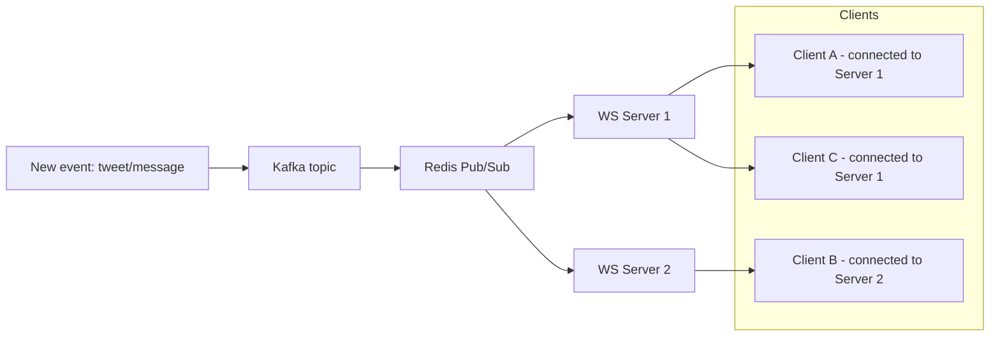

# WebSockets and real-time system design

Real-time features — live feeds, chat, collaborative editing, notifications — need a fundamentally different connection model than request/response HTTP. This covers the general principles of scalable web architecture, WebSocket protocol mechanics, how it compares to alternatives, how to scale it to millions of connections, and how Twitter/X, LinkedIn, Facebook, and Dropbox actually use it in production.

## TL;DR
- WebSockets (RFC 6455) upgrade an HTTP connection into a persistent, full-duplex TCP channel — both sides can push data anytime, no polling.
- Alternatives: HTTP polling (simple, wasteful), Server-Sent Events (SSE — simple, server-to-client only), long-polling (a stopgap between polling and WebSockets).
- WebSocket connections are **stateful** — this is the core scaling challenge. A server holding 10k+ open connections needs sticky sessions or a shared pub/sub layer (usually Redis) so a message can reach a client connected to *any* server in the fleet.
- Real systems (Twitter, LinkedIn, Facebook, Dropbox) all use a **pub/sub fanout** pattern: an event lands in a queue (Kafka), gets routed to whichever WebSocket gateway node holds the relevant connection, then pushed to the client.
- Large-scale architecture in general trades between monolith (simple, fast to build, scales vertically) and microservices (complex, scales horizontally, isolates failure) — the four case studies below all ended up microservices-heavy at scale.

## General principles of scalable web architecture

Large-scale web apps evolve from monoliths to distributed systems as they grow, trading simplicity for scalability, availability, and resilience.

### Monolithic vs. microservices

- **Monolithic**: all components (UI, business logic, data access) in a single codebase. Pros: simple deployment, easy debugging. Cons: scaling requires replicating the entire app; bottlenecks in shared resources. Early Facebook and Twitter both started monolithic and migrated as they grew.
- **Microservices**: decomposed into independent services (user service, feed service, etc.) communicating via APIs or message queues. Pros: independent scaling per service, tech diversity (Node.js for real-time paths, Java for batch). Cons: more complexity in orchestration and distributed tracing. LinkedIn runs 750+ services.

| Aspect | Monolithic | Microservices |
|---|---|---|
| Scalability | Vertical (bigger servers) | Horizontal (scale each service independently) |
| Development speed | Fast initially | Slower — requires cross-service coordination |
| Fault isolation | App-wide failures | Isolated to the failing service |
| Examples | Early Dropbox | Modern Twitter/X |

### Core components of a scalable architecture

- **Client layer**: browsers, mobile apps. CDNs (CloudFront, Akamai) serve static assets close to users. PWAs add offline support.
- **Load balancers & gateways**: distribute traffic (NGINX, AWS ALB). Layer 4 (TCP) for basic routing, Layer 7 (HTTP) for content-aware routing (e.g., send reads to replicas). Rate limiting (often via Redis) guards against abuse/DDoS. API gateways (Kong, AWS API Gateway) centralize auth and throttling.
- **Application servers**: stateless services, horizontally scaled via containers (Docker) orchestrated by Kubernetes. A service mesh (Istio) handles traffic management and observability between services.
- **Data layer**:
  - Databases: SQL (MySQL/PostgreSQL) for ACID-sensitive data like user profiles; NoSQL (Cassandra, DynamoDB) for high-write scalability like feeds. Sharded by user ID or hash.
  - Caching: Redis/Memcached for hot data with TTL-based eviction — often multi-level (in-process L1, distributed L2).
  - Storage: object stores (S3, GCS) for blobs; columnar stores (BigQuery) for analytics.
  - Message queues: Kafka/RabbitMQ for async processing (notifications, fanout); event sourcing for auditability.
- **Supporting services**: Elasticsearch for full-text search; Prometheus/Grafana for metrics, ELK stack for logs; OAuth/JWT for auth, encryption at rest and in transit.

```
[Clients (Web/Mobile)] --> [CDN (Static Assets)]
                          |
                          v
[Load Balancer / API Gateway] --> [Auth Service] --> [Rate Limiter]
                                           |
                                           v
[Microservices Cluster (Kubernetes)]
  - User Service --> [SQL DB (Sharded)]
  - Feed Service  --> [Redis Cache] --> [NoSQL (Feeds)]
  - Notification Service --> [Kafka Queue] --> [Push Service (FCM/APNs)]
  - Media Service --> [S3 Blob Storage]
                                           |
                                           v
[Monitoring (Prometheus)] <--> [Search (Elasticsearch)]
```

### Capacity planning and scaling strategies

- **Estimation basics**: start from DAU (e.g., ~200M for Twitter-scale), QPS (reads are typically ~10x writes for social apps), and data growth rate (e.g., ~1TB/day). Little's Law relates them: `Throughput = Arrival Rate × Response Time`.
- **Vertical scaling**: bigger instances — rarely sufficient alone at hyperscale.
- **Horizontal scaling**: add replicas, auto-scale via Kubernetes HPA.
- **Database scaling**: read replicas, sharding (consistent hashing), federation.
- **CAP trade-offs**: social apps typically prioritize Availability over Consistency (AP) during partitions, leaning on eventual consistency and CRDTs to reconcile — see `scaling-db/cap.md` for the full theorem.

## Case studies

### Twitter (X): real-time microblogging

Handles 500M+ users and 500M tweets/day, with a premium on low-latency feeds and viral fan-out.

**Requirements**:
- Functional: post tweets (text/media, 280 chars), follow/unfollow, home timeline (chronological or reverse-chrono), favorites, search, notifications.
- Non-functional: 99.99% availability, <200ms feed latency, ~15k write QPS, ~75k read QPS, ~50TB/year tweet data plus ~4PB media.

**Design**: hybrid fan-out-on-write for timelines — feeds are precomputed for most users, but pulled on-demand for celebrity accounts with huge follower counts (fan-out on write would be far too expensive per-tweet for someone with 100M followers). Built from Tweet Service, Follow Service, and Home Feed Service as separate microservices.

- **API layer**: RESTful endpoints (`POST /tweets`, `GET /feed?cursor=abc`); GraphQL for more complex feed queries.
- **Tweet Service**: validates and stores tweets in MySQL (sharded by tweetId), pushes to Kafka for async fan-out.
- **Follow Service**: manages the social graph in Neo4j (for recommendations) plus MySQL.
- **Timeline Service**: fans out writes to per-user Redis lists (`user:123:timeline`). For high fan-out accounts, pub-sub distributes to sharded caches instead of writing to every follower's list individually.
- **Data layer**: MySQL (master-slave) for users/tweets/follows; Manhattan (Twitter's internal NoSQL store) for timelines. Redis (LRU, 24h TTL) for hot tweets; Memcached for global lookups. S3 for media with presigned upload URLs.
- **Async processing**: Kafka streams feed both notifications and Elasticsearch indexing.

```
User Posts Tweet --> [Load Balancer] --> [Tweet Service] --> [MySQL Insert] --> [Kafka Topic]
                                                                 |
                                                                 v
[Follow Service] (Fan-out) --> [Redis: user_timeline:{userId}] for each follower
                                                                 |
                                                                 v
[Home Feed Service] <-- GET /feed --> Merge Redis lists + Cache miss --> Pull from DB
```

**Schema** (MySQL):
```sql
CREATE TABLE Users (userId BIGINT PRIMARY KEY, username VARCHAR(50), createdAt TIMESTAMP);
CREATE TABLE Tweets (tweetId BIGINT PRIMARY KEY, userId BIGINT, content TEXT, postTime TIMESTAMP INDEX);
CREATE TABLE Follows (followerId BIGINT, followeeId BIGINT, followedTime TIMESTAMP, INDEX(followeeId));
CREATE TABLE Favorites (userId BIGINT, tweetId BIGINT, INDEX(userId));
```
Sharding: tweets by `tweetId` hash; follows by `followerId`.

**Timeline strategies in detail**:
- **Fan-out on write**: pushes a new tweet to every follower's timeline immediately — efficient when a user has under ~10k followers; batched via queues.
- **Fan-out on read**: for celebrity accounts, query recent tweets on-demand instead, cached across shards (e.g., `celebrity_tweets_shard_0`).
- Hybrid in practice: roughly 80% fan-out-on-write, 20% fan-out-on-read for the long tail of high-follower accounts.

Notifications push via FCM/APNs, fanned out through Kafka to interested users. Search runs on Elasticsearch with analyzers tuned for hashtags and usernames, plus a graph-based component for recommendations.

**Evolution**: originally a monolith backed by FlockDB (a graph database); modern X runs a Kappa architecture — a single real-time pipeline through Kafka rather than separate batch/speed layers. Write amplification from fan-out was a persistent challenge, addressed by leaning into eventual consistency rather than trying to keep every replica perfectly in sync immediately.

### LinkedIn: professional networking at scale

Serves 1B+ members with feeds, jobs, messaging, and heavy investment in recommendation quality.

**Requirements**:
- Functional: profiles, connections (1st/2nd degree), feed (posts/articles), messaging, job search, endorsements.
- Non-functional: 99.99% uptime, <500ms feed latency, 100M+ DAU, 10PB+ data, GDPR compliance.

**Design**: microservices-heavy (750+ services), event-driven via Kafka. Core storage is Espresso, LinkedIn's distributed NoSQL store; Samza handles stream processing.

- **API layer**: REST plus GraphQL for feeds/jobs, served through the Voyager frontend framework.
- **Member Service**: CRUD for profiles/connections.
- **Feed Service**: reranks posts using ML models (TensorFlow).
- **Messaging Service**: real-time chat over WebSockets (see below).
- **Search Service**: Galileo, LinkedIn's semantic search system.
- **Data layer**: Espresso (sharded by member ID) plus MySQL for transactional data; Redis clusters replicated multi-region for global users; HDFS for analytics, S3 for media.
- **Async**: Kafka carries events like "post viewed" through to ranking updates.

```
Profile Update --> [API Gateway] --> [Member Service] --> [Espresso Write] --> [Kafka: member_events]
                                                                 |
                                                                 v
[Feed Service] (ML Rank) --> [Redis: personalized_feed:{memberId}] <-- GET /feed
                                                                 |
                                                                 v
[Search (Galileo)] <--> [Elasticsearch] for jobs/posts
```

**Schema** (Espresso-style NoSQL, JSON documents):
```json
{ "memberId": "123", "profile": { "name": "John Doe", "skills": ["Java", "System Design"] } }
{ "connectionId": "456", "fromMember": "123", "toMember": "789", "degree": 1 }
```
Sharding: consistent hashing on `memberId`.

**Feed design**: LinkedIn's "Economic Graph" model ranks posts by relevance (connections, interests). Small graphs use fan-in on read; larger/denser graphs precompute. Notifications go both in-app and via email, event-driven through Kafka. Search blends keyword matching (Lucene) with vector embeddings for skill matching.

**Evolution**: moved from a monolith to services through the 2010s; graph query performance was a persistent challenge, addressed with the Voldemort key-value store. Differential privacy techniques are applied in feed ranking to protect member data.

### Facebook (Meta): social graph at global scale

3B+ users, video-heavy feeds, with AR/VR integration work layered on top.

**Requirements**:
- Functional: posts/shares, friends/groups, news feed, Messenger, marketplace, events.
- Non-functional: global scale (10B+ reads/day), <100ms p95 latency, 99.999% durability.

**Design**: TAO (Facebook's graph store) backs reads of the social graph; core services historically built on Hack/PHP. TAO handles reads, MyRocks (MySQL + RocksDB) handles storage underneath.

- **API layer**: GraphQL for feeds; Thrift for internal RPC between services.
- **News Feed Service**: ranks using EdgeRank-style signals (affinity, content type, time decay).
- **Graph Service**: TAO serves the friends/posts graph.
- **Messenger Service**: WebSockets power real-time chat.
- **Data layer**: MyRocks for primary storage, Scuba for real-time analytics; Memcache (globally consistent hashing) for caching; Haystack for blob storage, f4 for cold storage.
- **Async**: Wormhole provides pub-sub across the system.

```
Post Creation --> [Edge Server] --> [News Feed Service] --> [TAO Graph Update] --> [Kafka-like PubSub]
                                                                 |
                                                                 v
[Feed Fetch] <-- GET /newsfeed --> Ranker (ML) + Cache (Memcache) + Pull from TAO
                                                                 |
                                                                 v
[CDN (Akamai)] for photos/videos
```

**Schema** (TAO associations):
```
{object_id: "post123", assoc_type: "like", subject_ids: [user1, user2]}
```
Sharded by object ID.

**Feed design**: a pull model — candidates are fetched from the graph, then ranked with ML (historically DeepText-style models). Cache hit rates around 80% keep read latency down. Notifications route through Torus, a dedicated push gateway. Search combines typeahead with Elasticsearch.

**Evolution**: moved from BigPipe (a technique for parallelizing page rendering by streaming page chunks) to React for the frontend. Global consistency across regions is a persistent challenge, addressed with eventual consistency backed by vector clocks to reason about causal ordering of graph updates.

### Dropbox: cloud storage and sync

700M+ users, 1B+ files/day, with sync correctness and conflict resolution as the core hard problem.

**Requirements**:
- Functional: upload/download, folder sharing, real-time sync, versioning, search.
- Non-functional: 99.999% durability, <1s sync latency, 10PB+ storage.

**Design**: chunk-based deduplication with Magic Pocket, Dropbox's custom-built storage system, replacing their original reliance on S3. Core services: Metadata, Block, and Sync.

- **API layer**: REST for file operations; WebDAV for compatibility with existing tools.
- **Upload Service**: chunks files, issues presigned S3-style URLs for direct upload.
- **Metadata Service**: tracks the file tree.
- **Sync Service**: delta sync coordinated through queues.
- **Data layer**: MySQL for metadata, Cassandra for block storage bookkeeping; Redis for session locks; Magic Pocket (erasure-coded, S3-like) for actual blob storage.
- **Async**: Scribe ships logs to HDFS.

```
File Change (Client Watcher) --> [Chunker] --> [Upload Chunks to S3 via Presigned URL] --> [Task Runner]
                                                                 |
                                                                 v
[Metadata DB Update] --> [Message Queue (Request Q)] --> [Sync Service] --> [Response Q for Clients]
                                                                 |
                                                                 v
[Download] <-- GET /file --> [Metadata Query] --> Reassemble Chunks from S3
```

**Schema** (MySQL metadata):
```sql
CREATE TABLE Files (fileId BIGINT PRIMARY KEY, userId BIGINT, parentId BIGINT, name VARCHAR, version INT, chunks JSON);
CREATE TABLE Chunks (chunkId BIGINT PRIMARY KEY, fileId BIGINT, hash VARCHAR, url VARCHAR);
CREATE TABLE Shares (shareId BIGINT, fileId BIGINT, userIds JSON);
```
Chunks are fixed at 4MB, deduplicated via SHA-256 hash.

**Sync design**: a local watcher detects file changes, an indexer processes them, and a chunker uploads only the deltas. Conflicts are resolved by versioning — a losing write becomes a "conflicted copy" file rather than silently overwriting. Search indexes both metadata and full-text content.

**Evolution**: moved off AWS S3 onto custom storage (Magic Pocket) primarily for cost reasons at their scale. Cross-device consistency is the persistent hard problem, addressed with CRDT-style merge logic for concurrent edits.

## WebSockets: protocol mechanics

WebSockets (RFC 6455) provide full-duplex, bidirectional communication over a single long-lived TCP connection — the mechanism underlying live tweet updates, LinkedIn notifications, Facebook Messenger, and Dropbox Paper's collaborative editing.

**Handshake**: starts as a normal HTTP/1.1 request with an `Upgrade` header; the server responds `101 Switching Protocols` and the connection becomes a raw WebSocket channel instead of HTTP. After that, both sides can send frames at any time — there's no request/response pairing anymore.

**Framing**: each message is sent as one or more frames, each with an opcode (text, binary, close, ping/pong), a payload (up to 2^63 bytes theoretically), and masking (required for client-to-server frames, to prevent cache-poisoning attacks against intermediate proxies).

**Lifecycle**: connect via `ws://` (or `wss://` for TLS), exchange frames, periodic ping/pong heartbeats (commonly every ~30s) to detect dead connections, then a close handshake (code 1000 = normal closure).

```javascript
const WebSocket = require('ws');
const wss = new WebSocket.Server({ port: 8080 });

wss.on('connection', (ws) => {
  ws.on('message', (message) => {
    wss.clients.forEach(client => client.send(message)); // Broadcast
  });
  ws.send('Connected!'); // Initial message
});
```

## WebSocket vs. alternatives

| Feature | HTTP polling | Long-polling | SSE | WebSockets |
|---|---|---|---|---|
| Direction | Unidirectional (client asks repeatedly) | Unidirectional, held open | Server → client only | Bidirectional |
| Overhead | High (new connection + headers every poll) | Medium (connection held, but still HTTP semantics) | Low (single long-lived connection) | Low (single long-lived connection) |
| Latency | Poll interval (seconds) | Near-instant while held | Near-instant | Near-instant |
| Use case | Simple, infrequent updates | Compatibility fallback | Server-push feeds, notifications | Chat, collaborative sync, anything bidirectional |
| Reconnection/fallback | N/A | N/A | Built-in browser auto-reconnect | Needs manual reconnect logic (or a library like Socket.io) |
| Proxy/firewall friendliness | Best (plain HTTP) | Good | Good (plain HTTP, one connection) | Can be blocked by strict proxies expecting classic HTTP |

**When to use which**: plain HTTP polling is fine for infrequent, non-critical updates (a dashboard refreshing every 30s). SSE is the right choice when data only flows server→client — a live score feed, a notification stream — because it's simpler than WebSockets and has automatic reconnection built into the browser API. WebSockets are worth the added complexity specifically when the client also needs to send data frequently and with low latency — chat, multiplayer, collaborative editing, trading platforms.

## Real-time features in the case study apps

- **Twitter/X**: WebSockets drive live tweet updates, like counters, and Spaces audio. Socket servers (Node.js) sit behind load balancers, multiplexed by user session. Events flow from Kafka into WebSocket gateway nodes for fan-out; at scale this handles 1M+ concurrent connections for live events.
- **LinkedIn**: WebSockets power in-app notifications, messaging, typing indicators, and read receipts — integrated with Kafka for event routing, with SSE as a fallback for simpler feed updates.
- **Facebook (Meta)**: Messenger uses WebSockets for real-time chat, run through a dedicated connection cluster (Torus) with ML-based spam filtering applied inline; group chats multiplex multiple conversation streams over a connection.
- **Dropbox**: Paper (Dropbox's collaborative doc product) uses WebSockets, served from Go, for real-time collaborative editing similar to Google Docs — built on Operational Transform (OT) to merge concurrent edits conflict-free.

**Common pattern across all four**: an event (new tweet, new message, doc edit) lands in a queue (Kafka), gets routed to whichever WebSocket handler owns the relevant client connection(s), then broadcast to subscribers of that "room" (a user, a feed, a document).

## Scaling WebSocket connections

Scaling to millions of concurrent connections is a fundamentally different problem than scaling stateless HTTP request handling, because each WebSocket connection is **stateful** — it's pinned to whichever server accepted it, and that server has to hold it open in memory for the connection's entire lifetime.

### The core challenges

- **Connection limits**: each open TCP connection carries real memory/CPU overhead. Holding 1M concurrent connections can require 100GB+ of RAM across a fleet, depending on per-connection buffer sizes.
- **Sticky sessions**: a client that reconnects must reach the same server that holds its session state (or the server needs to look that state up from somewhere shared) — typically solved with IP-hash load balancing or a session lookup in Redis.
- **Broadcast efficiency**: naively looping over all connections to broadcast a message is O(n) per broadcast and doesn't scale — you need multicast-style fanout or sharding by topic/room.
- **Failover**: when a WebSocket server dies, every connection it held drops. Clients need graceful reconnect logic with exponential backoff (see the retry-with-backoff pattern in `os-and-design-patterns/design-patterns.md`) so a server restart doesn't cause a reconnection storm.

### Scaling strategies

- **Horizontal scaling with sharding**: partition users across servers by a hash of user ID; load balancers route with sticky (IP-hash) routing. Socket.io's Redis adapter is the standard off-the-shelf tool for clustering WebSocket servers in Node.js.
- **Pub/sub fanout via Redis**: since a broadcast target might be connected to a *different* server than the one that received the triggering event, servers publish events to a shared Redis pub/sub channel (or Redis Streams); every server subscribes and forwards matching messages to its own locally-connected clients only.
- **Multiplexing**: protocols like STOMP layered over WebSockets let one physical connection carry multiple logical channels (e.g., `/feed/user123`, `/notifications/user123`) instead of opening a separate socket per feature.
- **Backpressure**: queue outbound messages per connection and drop or coalesce low-priority updates when a slow client can't keep up, rather than blocking the whole server on one slow consumer.
- **Monitoring**: track open connection counts and message rates per node, and auto-scale the WebSocket tier based on connection count (not just CPU, which under-represents the cost of idle-but-open connections).

### Pub/sub fanout across servers



Every server subscribes to the shared Redis channel(s), but only forwards a message to clients it actually holds a connection for — this is what lets a message reach the right user regardless of which server in the fleet they happen to be connected to.

| Technique | Description | Example tool | Pros/cons |
|---|---|---|---|
| Sharding | Partition users across servers | Consistent hash rings | Even load / rebalancing cost on scale-up/down |
| Redis pub/sub | Offload cross-server broadcasting | Redis Streams / Pub-Sub | Scales well / Redis itself becomes a single point of failure unless clustered |
| Vertical scaling | Fewer, beefier servers | e.g. large-memory cloud instances | Simple to operate / costly, has a ceiling |
| SSE fallback | For unidirectional-only needs | N/A | Simpler ops / no bidirectional channel |

**In practice**: DraftKings scales to 1M+ concurrent WebSocket connections using Kubernetes plus Redis, with circuit breakers absorbing traffic spikes. Twitter shards its WebSocket tier geographically to keep latency low for globally distributed users.

```javascript
const Redis = require('ioredis');
const redis = new Redis();
const io = require('socket.io')(server, { adapter: new RedisAdapter(redis) });

io.on('connection', (socket) => {
  socket.join('user_' + socket.userId); // Room for user
  socket.on('tweet', (data) => io.to('global_feed').emit('new_tweet', data));
});
```

### Emerging directions

- **WebTransport over QUIC/HTTP3**: multiplexed, reliable (and unreliable-if-wanted) streams without TCP head-of-line blocking — a candidate successor to WebSockets for some use cases.
- **Edge computing**: platforms like Cloudflare Workers can terminate WebSocket connections at the edge, closer to users, reducing the fanout problem's blast radius per region.
- **Predictive buffering**: ML-driven prefetching/buffering for mobile clients on unreliable networks.

## Quick reference
- WebSocket handshake: HTTP `Upgrade` request → `101 Switching Protocols` → full-duplex frames until a close handshake.
- Choose SSE over WebSockets when data only flows server→client — simpler, built-in reconnection.
- Choose WebSockets when the client needs to push data too, with low latency (chat, collaborative editing, live multiplayer).
- The core WebSocket scaling problem: connections are stateful and pinned to a server — solve cross-server delivery with Redis pub/sub (or Kafka) fanout, not naive broadcast loops.
- Sticky sessions (IP hash) or a shared session store keep reconnects landing where the client's state actually lives.
- All four case studies (Twitter, LinkedIn, Facebook, Dropbox) use the same underlying pattern: event → queue (Kafka) → routed to the right WebSocket gateway → pushed to client.

## Further reading
- RFC 6455 (The WebSocket Protocol).
- "System Design Interview" by Alex Xu, for general capacity-estimation and architecture patterns.
- Socket.io documentation on the Redis adapter, for a concrete implementation of cross-server pub/sub fanout.
- See `scaling-db/cap.md` for the consistency/availability trade-offs referenced in the case studies above.
